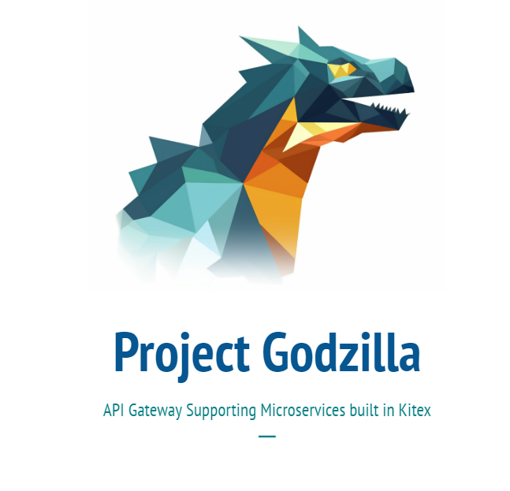

IDL_management_page contains the user interface

JSONGenwithpostres contains the Code generator

pages-backend-test contains the backend server for interacting with the database

Docker Setup guide

1.  RUN "docker pull quay.io/coreos/etcd:v3.5.0"
2.  RUN "docker-compose up" at root directory
3.  RUN "docker pull postgres:latest"
4.  RUN "docker run --name some-postgres -e POSTGRES_PASSWORD=mysecretpassword -e POSTGRES_DB=mydatabase -p 5432:5432 -d postgres"
5.  Start the containers on docker

Frontend Setup guide

1. RUN "cd .\IDL_management_page\page\my-app\"
2. RUN "npm install"
3. RUN "npx prisma migrate dev --name init --schema=prisma/schema.prisma"
4. RUN "npx prisma generate --schema=prisma/schema.prisma"

Backend Setup guide

1. RETURN TO ROOT DIRECTORY
2. RUN "cd .\pages-backend-test\pages-backend\"
3. RUN "npx prisma migrate dev --name init --schema=prisma/schema.prisma"
4. RUN "npx prisma generate --schema=prisma/schema.prisma"

Nginx Setup guide (MacOS)

1. RUN "brew install nginx"

Nginx Setup guide (Windows)

1. Download Nginx from official Nginx website
2. RUN "setx NGINX_PATH "C:\path\to\nginx\directory" /M" on terminal (IMPORTANT)

To Start The Application:

1. RUN "npm run dev" under \IDL_management_page\page\my-app\
2. RUN "node index.js" under \pages-backend-test\pages-backend\
3. Open a browser on localhost:3000

Assumptions:

1. Docker is installed
2. Node.js is installed
3. Nginx is installed
4. No process is running on ports 8888, 8889, 8890, 20000, 5432, 3000, 3333 (Will make improvement to the customisibility in the future)
